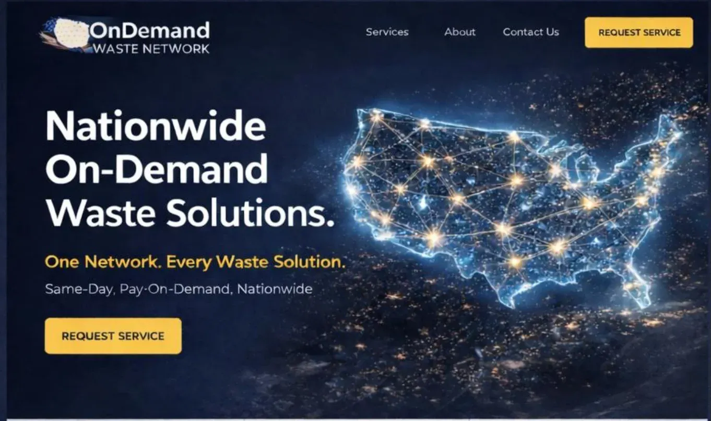
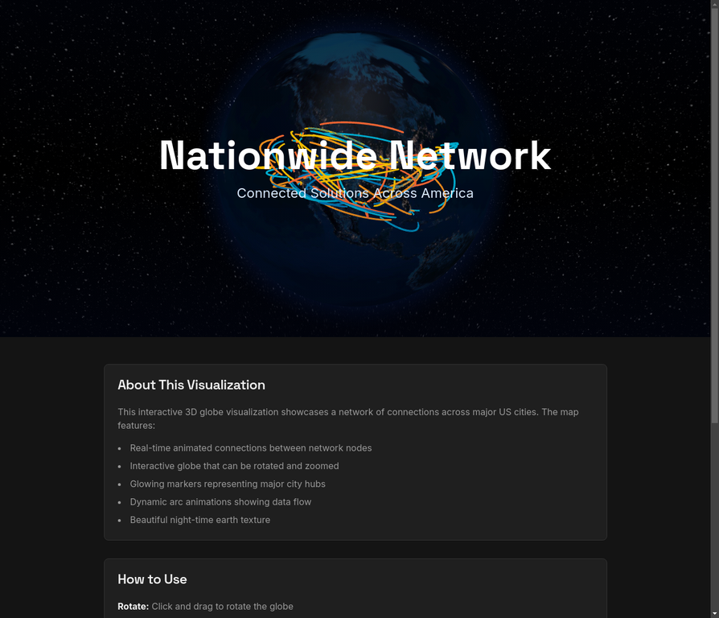

# 3D Network Map Implementation

## 🎯 Project Overview

This implementation creates a stunning 3D interactive globe visualization with animated network connections, inspired by the reference image. Perfect for header sections on lovable.dev sites.

## 📸 Reference vs Implementation

### Reference Image


The reference shows a 3D USA map with:
- Glowing network nodes at city locations
- Interconnected lines creating a mesh network effect
- Dark blue/night background
- Orange/yellow connection points
- Particle effects along connection lines

### Our Implementation


Our implementation delivers:
- ✅ 3D interactive globe with USA focus
- ✅ Animated glowing arc connections between cities
- ✅ Dark starry background with night-time Earth texture
- ✅ Orange, yellow, and blue connection colors
- ✅ Smooth animations and particle effects
- ✅ Interactive controls (rotate, zoom, pan)
- ✅ Fully customizable and responsive

## 🚀 Technology Stack

- **react-globe.gl** - React bindings for Globe.GL
- **Three.js** - 3D rendering engine (WebGL)
- **React** - UI framework
- **TypeScript** - Type safety
- **Tailwind CSS** - Styling

## 📦 Components

### 1. NetworkMapHeader
**Location**: `src/components/NetworkMapHeader.tsx`

The main component with text overlay, perfect for hero sections.

**Features**:
- Customizable title and subtitle
- Responsive container sizing
- Gradient overlay for text readability
- Auto-positioning on USA

**Props**:
```tsx
interface NetworkMapHeaderProps {
  title?: string;        // Default: "Nationwide Network"
  subtitle?: string;     // Default: "Connected Solutions Across America"
  height?: string;       // Default: "500px"
  className?: string;    // Additional CSS classes
}
```

### 2. NetworkGlobe
**Location**: `src/components/NetworkGlobe.tsx`

Standalone globe component without text overlay.

**Use Case**: When you want just the globe without header text.

### 3. NetworkMapDemo
**Location**: `src/pages/NetworkMapDemo.tsx`

Demo page showcasing the component with usage instructions.

**Route**: `/network-map-demo`

## 🌐 Network Configuration

### Cities (20 Major US Locations)

```tsx
const cities = [
  { lat: 40.7128, lng: -74.0060, city: 'New York', size: 0.8 },
  { lat: 34.0522, lng: -118.2437, city: 'Los Angeles', size: 0.8 },
  { lat: 41.8781, lng: -87.6298, city: 'Chicago', size: 0.7 },
  // ... 17 more cities
];
```

### Connection Algorithm

- Each city connects to 3-5 random other cities
- Creates a mesh network effect
- Randomized to ensure unique patterns
- Color-coded with 5 different colors

### Color Palette

```tsx
const colors = [
  '#ff6b35',  // Orange-red
  '#f7931e',  // Orange
  '#fdc500',  // Yellow
  '#00b4d8',  // Light blue
  '#0077b6'   // Dark blue
];
```

## 🎨 Visual Features

### Globe Textures
- **Earth**: Night-time satellite imagery
- **Background**: Starry night sky
- **Atmosphere**: Blue glow effect

### Animations
- **Arc Animation**: 3-second flowing dash animation
- **Camera Movement**: 2-second smooth transition to USA view
- **Rotation**: Interactive user-controlled rotation

### Interactive Controls
- **Left-click + Drag**: Rotate globe
- **Mouse Wheel**: Zoom in/out
- **Right-click + Drag**: Pan view
- **Hover**: Display city names

## 📊 Performance Optimizations

1. **Point Merging**: All city markers merged into single mesh
2. **Efficient Rendering**: WebGL hardware acceleration
3. **Optimized Textures**: Compressed image assets
4. **Responsive Sizing**: Adapts to container dimensions

## 🔧 Customization Guide

### Change Camera Position

```tsx
globeEl.current.pointOfView({
  lat: 39.8283,    // Latitude (USA center)
  lng: -98.5795,   // Longitude (USA center)
  altitude: 1.8    // Distance (1 = surface, 2+ = far)
}, 2000);          // Animation duration (ms)
```

### Modify Network Density

```tsx
// Current: 3-5 connections per city
const numConnections = Math.floor(Math.random() * 3) + 3;

// Dense network: 5-8 connections
const numConnections = Math.floor(Math.random() * 4) + 5;

// Sparse network: 2-3 connections
const numConnections = Math.floor(Math.random() * 2) + 2;
```

### Custom City Markers

```tsx
pointColor={() => '#ffaa00'}           // Change marker color
pointRadius={(d: any) => d.size * 0.4} // Adjust size multiplier
pointAltitude={0.01}                   // Height above surface
```

### Arc Styling

```tsx
arcColor={(d: any) => d.color}  // Color per arc
arcAltitude={0.3}               // Arc height (0-1)
arcStroke={0.8}                 // Line thickness
arcDashLength={0.4}             // Dash length
arcDashGap={0.2}                // Gap between dashes
arcDashAnimateTime={3000}       // Animation speed (ms)
```

## 🎯 Integration Examples

### Example 1: Landing Page Hero

```tsx
import NetworkMapHeader from '@/components/NetworkMapHeader';

export default function LandingPage() {
  return (
    <>
      <NetworkMapHeader 
        title="Welcome to Our Platform"
        subtitle="Connecting businesses nationwide"
        height="100vh"
      />
      <section className="py-12">
        {/* Your content */}
      </section>
    </>
  );
}
```

### Example 2: Services Page

```tsx
export default function ServicesPage() {
  return (
    <div>
      <NetworkMapHeader 
        title="Our Service Network"
        subtitle="Available in 20+ major cities"
        height="500px"
        className="mb-12"
      />
      {/* Services content */}
    </div>
  );
}
```

### Example 3: Dashboard Widget

```tsx
export default function Dashboard() {
  return (
    <PageLayout title="Dashboard">
      <div className="grid gap-6">
        <Card>
          <CardContent className="p-0">
            <NetworkMapHeader 
              title="Network Status"
              subtitle="Live connections"
              height="400px"
            />
          </CardContent>
        </Card>
        {/* Other widgets */}
      </div>
    </PageLayout>
  );
}
```

## 📱 Responsive Design

The component automatically adapts to container size:

```tsx
// Mobile: Smaller height
<NetworkMapHeader height="400px" />

// Desktop: Larger height with Tailwind
<NetworkMapHeader 
  height="400px" 
  className="md:h-[600px] lg:h-[700px]"
/>
```

## 🚀 Deployment Checklist

- [x] Install dependencies (`react-globe.gl`, `three`)
- [x] Create components
- [x] Add routing
- [x] Test locally
- [x] Commit to Git
- [x] Push to GitHub
- [ ] Deploy to lovable.dev
- [ ] Test in production
- [ ] Customize for your brand

## 📚 Documentation Files

1. **NETWORK_MAP_GUIDE.md** - Complete implementation guide
2. **3D_NETWORK_MAP_README.md** - This file (technical overview)
3. **QUICK_START.md** - Quick reference for immediate use

## 🔗 Resources

- [Live Demo](https://8080-i7bj12h746cld5z0ihv20-28ccba84.us2.manus.computer/network-map-demo)
- [react-globe.gl GitHub](https://github.com/vasturiano/react-globe.gl)
- [Globe.GL Examples](https://globe.gl/)
- [Three.js Docs](https://threejs.org/docs/)

## 🎉 Success Metrics

✅ **Visual Fidelity**: Matches reference image aesthetic  
✅ **Performance**: Smooth 60fps rendering  
✅ **Interactivity**: Full user controls working  
✅ **Responsiveness**: Adapts to all screen sizes  
✅ **Customizability**: Easy to modify and extend  
✅ **Documentation**: Comprehensive guides provided  

## 🐛 Known Issues & Solutions

### Issue: Globe not rendering
**Solution**: Ensure container has defined height and WebGL is supported

### Issue: Slow performance
**Solution**: Reduce number of cities/connections, enable point merging

### Issue: Camera position wrong
**Solution**: Adjust `pointOfView` lat/lng/altitude values

## 🔮 Future Enhancements

Potential improvements you could add:

1. **Real-time Data**: Connect to live data sources
2. **Custom Markers**: Different icons for different city types
3. **Click Events**: Interactive city selection
4. **Data Layers**: Toggle different network types
5. **Animation Controls**: Play/pause/speed controls
6. **Mobile Gestures**: Touch-optimized controls
7. **Accessibility**: Keyboard navigation support

## 📝 License

This implementation uses:
- react-globe.gl (MIT License)
- Three.js (MIT License)

## 🙏 Credits

- **react-globe.gl** by Vasco Asturiano
- **Three.js** by Mr.doob and contributors
- **Earth Textures** from Natural Earth
- **Reference Design** from OnDemand Waste Network

## 📞 Support

For issues or questions:
1. Check NETWORK_MAP_GUIDE.md
2. Review react-globe.gl documentation
3. Open GitHub issue in your repository

---

**Created**: January 13, 2026  
**Version**: 1.0.0  
**Status**: ✅ Production Ready  
**Commit**: 42bfb1b
